# MCP Hub Lite - AI 编程助手指南

## 变更记录 (Changelog)

查看完整变更记录：[CHANGELOG_zh-CN.md](CHANGELOG_zh-CN.md)

### 2026-02-15

- 新增会话持久化功能：会话状态自动保存到磁盘，支持服务重启后恢复
- 新增会话管理 API：提供会话列表、详情查询和删除接口
- 新增配置安全选项：会话超时可配置（默认 30 分钟）
- 更新模块文档：完善所有相关模块的文档覆盖
- 更新模块结构图：添加 Mermaid 树形图
- 完善面包屑导航：所有模块文档添加导航面包屑

### 2026-02-05

- 更新项目索引和文档覆盖率
- 完善所有模块的 CLAUDE.md 文档
- 更新 .claude/index.json 索引文件
- 优化模块索引表格

## 项目概述

MCP Hub Lite 是一个轻量级的 MCP (Model Context Protocol) 网关系统，专为独立开发者设计。它充当前端和多个后端 MCP 服务器之间的代理，提供统一的访问界面，支持 MCP JSON-RPC 2.0 协议。

### 核心功能

- **MCP 网关服务**: 作为多个后端 MCP 服务器的统一代理接口
- **[服务器管理](src/services/hub-manager.service.ts)**: 通过 Web 界面管理多个 MCP 服务器
- **[工具搜索](src/services/search/search-core.service.ts)**: 跨所有服务器进行模糊搜索和工具发现
- **[进程管理](src/pid/manager.ts)**: 支持通过 npx/uvx 启动和管理 MCP 服务器进程
- **[会话管理](src/services/mcp-session-manager.ts)**: 基于 sessionId 的会话状态管理，支持会话持久化和恢复
- **WebSocket 实时通信**: 客户端追踪和事件推送支持
- **配置标签**: 使用结构化标签按环境、类别、功能等组织多个 MCP 服务器
- **容错处理**: 单个服务器故障时系统继续运行
- **双语界面**: 支持中文/英文界面切换
- **配置管理**: 支持 `.mcp-hub.json` 配置文件的热重载和维护

## 技术栈

- **TypeScript 5.x** + Node.js 22.x
- **Fastify**: 高性能 HTTP 服务器
- **MCP SDK**: 官方 MCP 协议支持 (@modelcontextprotocol/sdk)
- **Vitest**: 单元测试框架
- **Zod**: 数据验证
- **Vue 3**: 前端 UI 框架
- **Pinia**: 前端状态管理
- **Element Plus**: UI 组件库
- **OpenTelemetry**: 分布式追踪支持

## 模块结构图

```mermaid
graph TD
    A["(根) MCP Hub Lite"] --> B["src/"];
    A --> C["frontend/"];
    A --> D["tests/"];
    A --> E["shared/"];

    B --> B1["api/"];
    B --> B2["services/"];
    B --> B3["models/"];
    B --> B4["config/"];
    B --> B5["utils/"];
    B --> B6["cli/"];
    B --> B7["pid/"];
    B --> B8["server/"];

    C --> C1["src/components/"];
    C --> C2["src/views/"];
    C --> C3["src/stores/"];
    C --> C4["src/router/"];
    C --> C5["src/i18n/"];
    C --> C6["src/composables/"];

    D --> D1["unit/"];
    D --> D2["integration/"];
    D --> D3["contract/"];

    E --> E1["models/"];
    E --> E2["types/"];

    click B1 "./src/api/CLAUDE.md" "查看 API 模块文档"
    click B2 "./src/services/CLAUDE.md" "查看 Services 模块文档"
    click B3 "./src/models/CLAUDE.md" "查看 Models 模块文档"
    click B4 "./src/config/CLAUDE.md" "查看 Config 模块文档"
    click B5 "./src/utils/CLAUDE.md" "查看 Utils 模块文档"
    click B6 "./src/cli/CLAUDE.md" "查看 CLI 模块文档"
    click B7 "./src/pid/CLAUDE.md" "查看 PID 模块文档"
    click B8 "./src/server/CLAUDE.md" "查看 Server 模块文档"

    click C1 "./frontend/src/components/CLAUDE.md" "查看 Components 模块文档"
    click C2 "./frontend/src/views/CLAUDE.md" "查看 Views 模块文档"
    click C3 "./frontend/src/stores/CLAUDE.md" "查看 Stores 模块文档"
    click C4 "./frontend/src/router/CLAUDE.md" "查看 Router 模块文档"
    click C5 "./frontend/src/i18n/CLAUDE.md" "查看 i18n 模块文档"

    click D1 "./tests/unit/CLAUDE.md" "查看 Unit Tests 文档"
    click D2 "./tests/integration/CLAUDE.md" "查看 Integration Tests 文档"
    click D3 "./tests/contract/CLAUDE.md" "查看 Contract Tests 文档"

    click E1 "./shared/CLAUDE.md" "查看 Shared Models 文档"
    click E2 "./shared/CLAUDE.md" "查看 Shared Types 文档"
```



## 模块索引

| 模块路径                   | 职责描述                                                       | 语言           |
| -------------------------- | -------------------------------------------------------------- | -------------- |
| `src/`                     | 后端源代码，包含所有服务器端逻辑                               | TypeScript     |
| `src/api/`                 | API 路由和协议处理器，包括 MCP JSON-RPC、Web API 和 WebSocket  | TypeScript     |
| `src/services/`            | 核心业务逻辑服务，包括网关、连接管理、搜索、日志存储、会话管理 | TypeScript     |
| `src/models/`              | 数据模型和类型定义                                             | TypeScript     |
| `src/config/`              | 配置管理和验证                                                 | TypeScript     |
| `src/utils/`               | 工具函数和通用实现                                             | TypeScript     |
| `src/cli/`                 | 命令行接口和命令处理                                           | TypeScript     |
| `src/pid/`                 | 进程 ID 管理和文件操作                                         | TypeScript     |
| `src/server/`              | 服务器运行时和启动器                                           | TypeScript     |
| `frontend/`                | Vue3 前端应用                                                  | TypeScript/Vue |
| `frontend/src/components/` | 可复用 UI 组件                                                 | Vue            |
| `frontend/src/views/`      | 页面视图组件                                                   | Vue            |
| `frontend/src/stores/`     | Pinia 状态管理                                                 | TypeScript     |
| `frontend/src/router/`     | Vue Router 路由配置                                            | TypeScript     |
| `frontend/src/i18n/`       | 国际化支持                                                     | TypeScript     |
| `shared/`                  | 前后端共享的模型和类型定义                                     | TypeScript     |
| `tests/unit/`              | 单元测试                                                       | TypeScript     |
| `tests/integration/`       | 集成测试                                                       | TypeScript     |
| `tests/contract/`          | 契约测试                                                       | TypeScript     |

## 架构总览

### 核心架构

**统一入口设计**

- CLI入口：`src/index.ts` - 处理命令行参数
- 后端服务入口：`src/app.ts` - Fastify应用配置
- 服务器启动器：`src/server/runner.ts` - 启动Fastify服务器和MCP网关

**核心服务组件**

- **HubManagerService**: MCP服务器生命周期管理
- **GatewayService**: MCP网关服务（HTTP-Stream传输）
- **McpConnectionManager**: 服务器连接和工具调用
- **McpSessionManager**: 基于sessionId的会话管理（支持持久化）
- **SearchCoreService**: 模糊搜索和过滤器
- **EventBusService**: 模块间事件通信

### 会话持久化

**功能特性**:

- 会话状态自动保存到磁盘（`~/.mcp-hub-lite/sessions/`）
- 服务重启后自动恢复会话状态
- 脏数据追踪，5秒批量刷新，减少 I/O
- 优雅关闭处理，确保数据不丢失
- 可配置的会话超时（默认 30 分钟）

**相关文件**:

- `src/services/mcp-session-manager.ts` - 会话管理器实现
- `shared/models/session.model.ts` - 会话数据模型（前后端共享）
- `src/api/web/sessions.ts` - 会话管理 API

### 传输协议支持

项目通过 `src/utils/transports/` 目录支持多种 MCP 传输协议：

- **StdioTransport**: 标准输入输出传输，用于本地进程
- **SseTransport**: Server-Sent Events 传输，用于单向 HTTP-Stream 通信
- **StreamableHttpTransport**: HTTP 流传输，支持流式响应

传输工厂（`TransportFactory`）根据服务器配置自动创建对应的传输实例。

## 运行与开发

### 快速开始

```bash
# 安装依赖
npm install

# 开发模式运行（前后端热重载）
npm run dev

# 构建生产版本
npm run build

# 完整检查（构建 + 测试 + 代码检查）
npm run full:check

# 运行生产版本
npm start

# 查看状态
npm run status

# 打开UI界面
npm run ui
```

### CLI 命令

| 命令                              | 描述                 |
| --------------------------------- | -------------------- |
| `mcp-hub-lite start`              | 启动MCP Hub Lite服务 |
| `mcp-hub-lite start --foreground` | 前台运行             |
| `mcp-hub-lite stop`               | 停止服务             |
| `mcp-hub-lite status`             | 查看服务状态         |
| `mcp-hub-lite ui`                 | 打开Web UI           |
| `mcp-hub-lite list`               | 列出所有MCP服务器    |

### 服务器配置

MCP-HUB-LITE 使用 `.mcp-hub.json` 文件进行配置。配置查找优先级：

1. 环境变量 `MCP_HUB_CONFIG_PATH`
2. 当前目录的 `.mcp-hub.json`
3. `config/.mcp-hub.json`
4. `~/.mcp-hub.json`

### 环境变量

| 变量            | 描述             |
| --------------- | ---------------- |
| `PORT`          | 覆盖配置的端口   |
| `HOST`          | 覆盖配置的主机   |
| `LOG_LEVEL`     | 覆盖日志级别     |
| `SESSION_DEBUG` | 启用会话调试日志 |

## 测试策略

### 测试结构

```
tests/
├── unit/                    # 单元测试
│   ├── server/              # 服务器运行时测试
│   ├── services/            # 服务测试
│   ├── utils/              # 工具测试
│   └── frontend/           # 前端组件和Store测试
├── integration/             # 集成测试
│   ├── api/                # API测试
│   └── gateway/            # Gateway测试
└── contract/               # 契约测试
    └── mcp-protocol/       # MCP协议契约测试
```

### 运行测试

```bash
# 运行所有测试（静默模式 + 生成摘要）
npm test

# 使用 Vitest 直接运行（开发模式，带颜色输出）
npx vitest

# 单独运行后端测试
npm run test:backend

# 单独运行前端测试
npm run test:frontend

# 在静默模式下运行后端测试（输出到日志文件）
npm run test:backend:silent

# 在静默模式下运行前端测试（输出到日志文件）
npm run test:frontend:silent

# 运行测试并生成覆盖率报告
npm run test:coverage

# 生成测试结果摘要（读取日志文件生成摘要）
npm run test:summary
```

### 测试结果查看

`npm test` 采用静默模式运行，测试输出重定向到日志文件：

1. **运行完整测试**：执行 `npm test`（静默模式）
2. **生成摘要**：测试完成后自动生成 `logs/test-summary.log`
3. **查看结果**：摘要包含测试文件统计、用例统计、失败详情等

**日志文件：**

- `logs/test-summary.log` - 测试摘要汇总
- `logs/test-backend.log` - 后端测试详细输出
- `logs/test-frontend.log` - 前端测试详细输出

**查看实时输出（带颜色）：**

```bash
# 开发模式带热重载
npx vitest

# 单独运行后端/前端测试
npm run test:backend
npm run test:frontend
```

### 测试覆盖

| 类型     | 状态     | 文件数 |
| -------- | -------- | ------ |
| 单元测试 | 部分实现 | 15     |
| 集成测试 | 部分实现 | 3      |
| 契约测试 | 完整实现 | 3      |

## 编码规范

本项目严格遵循以下规范：

### ESM 模块系统规范

- 强制使用 ECMAScript Modules (ESM) 模块系统
- 禁止使用 CommonJS 语法
- 导入本地模块时必须显式包含文件扩展名

完整规范参见：[`.claude/rules/esm.md`](.claude/rules/esm.md)

### TypeScript 规范

完整的 TypeScript 规范设计请参见：[`.claude/rules/typescript.md`](.claude/rules/typescript.md)

该`规范采用模块化管理，包含以下专题：

- 基础类型安全规范
- Vue3 + TypeScript 集成规范
- 测试框架与规范 (Vite + Vitest)
- 代码组织与模块化分层规范
- 性能与配置管理规范
- 错误处理与日志规范
- CI/CD 与质量保证规范

### 命名规范

完整的命名规范请参见：[`.claude/rules/naming.md`](.claude/rules/naming.md)

- **代码元素**（变量、函数、类、配置键等）：使用驼峰命名法 (CamelCase)
- **文件系统元素**（文件名、目录名、URL路径等）：使用中划线命名法 (KebabCase)

## 开发流程

基于 Spec-Plan-Tasks 工作流：

1. **Specification** (spec.md) - 功能规格说明
2. **Plan** (plan.md) - 设计与实施计划
3. **Tasks** (tasks.md) - 具体的开发任务

完整的开发流程指南请参见：[`.claude/rules/development.md`](.claude/rules/development.md)

## 质量要求

### 代码修改验证流程

**每轮代码修改结束后，必须按顺序执行以下验证步骤：**

1. **编译检查**：执行 `npm run build` 进行完整的编译和类型检查
2. **测试验证**：执行 `npm run test` 运行所有测试（自动包含结果摘要）

查看测试结果摘要：`cat logs/test-summary.log`

详细规范参见：[`.claude/rules/development.md`](.claude/rules/development.md)

## Git 提交规范

详细规范参见：[`.claude/rules/git.md`](.claude/rules/git.md)

## 完整变更记录

查看完整变更记录：[CHANGELOG_zh-CN.md](CHANGELOG_zh-CN.md)
