# MCP Hub Lite - AI 编程助手指南

## 项目概述

MCP Hub Lite 是一个轻量级的 MCP (Model Context Protocol) 网关系统，专为独立开发者设计。它充当前端和多个后端 MCP 服务器之间的代理，提供统一的访问界面，支持 MCP JSON-RPC 2.0 协议。

### 核心功能

- **MCP 网关服务**: 作为多个后端 MCP 服务器的统一代理接口
- **服务器管理**: 通过 Web 界面管理多个 MCP 服务器
- **工具搜索**: 跨所有服务器进行模糊搜索和工具发现
- **进程管理**: 支持通过 npx/uvx 启动和管理 MCP 服务器进程
- **标签系统**: 使用结构化标签按环境、类别、功能等组织多个 MCP 服务器
- **容错处理**: 单个服务器故障时系统继续运行
- **双语界面**: 支持中文/英文界面切换
- **配置管理**: 支持 `.mcp-hub.json` 配置文件的热重载和维护

## 技术栈

- **TypeScript 5.x** + Node.js 20.x
- **Fastify**: 高性能 HTTP 服务器
- **MCP SDK**: 官方 MCP 协议支持
- **Vitest**: 单元测试框架
- **Zod**: 数据验证
- **Vue 3**: 前端 UI 框架
- **Pinia**: 前端状态管理
- **Element Plus**: UI 组件库

## 模块结构图

```mermaid
graph TD
    ROOT["(根) mcp-hub-lite"] --> SRC["src/ (后端源码)"];
    ROOT --> FRONTEND["frontend/ (前端源码)"];
    ROOT --> TESTS["tests/ (测试)"];
    ROOT --> SPECS["specs/ (规格文档)"];
    ROOT --> CLAUDE[".claude/ (规范文档)"];

    SRC --> API["api/ (API处理)"];
    SRC --> SERVICES["services/ (核心业务逻辑)"];
    SRC --> MODELS["models/ (数据模型)"];
    SRC --> CONFIG["config/ (配置管理)"];
    SRC --> UTILS["utils/ (工具函数)"];
    SRC --> CLI["cli/ (命令行接口)"];
    SRC --> PID["pid/ (进程ID管理)"];
    SRC --> SERVER["server/ (服务器运行时)"];

    API --> MCP["mcp/ (MCP协议)"];
    API --> WEB["web/ (Web API)"];

    SERVICES --> GATEWAY["gateway.service.ts"];
    SERVICES --> HUB["hub-manager.service.ts"];
    SERVICES --> SEARCH["search/ (搜索服务)"];
    SERVICES --> MCP_CONN["mcp-connection-manager.ts"];
    SERVICES --> HUB_TOOLS["hub-tools.service.ts"];
    SERVICES --> LOG_STORAGE["log-storage.service.ts"];

    MODELS --> TYPES["types.ts"];
    MODELS --> SERVER_MODEL["server.model.ts"];
    MODELS --> TOOL_MODEL["tool.model.ts"];
    MODELS --> RESOURCE_MODEL["resource.model.ts"];

    CONFIG --> CONFIG_MGR["config-manager.ts"];
    CONFIG --> SCHEMA["config.schema.ts"];

    UTILS --> LOGGER["logger.ts"];
    UTILS --> TRANSPORTS["transports/"];

    FRONTEND --> COMPONENTS["components/"];
    FRONTEND --> VIEWS["views/"];
    FRONTEND --> STORES["stores/"];
    FRONTEND --> ROUTER["router/"];
    FRONTEND --> I18N["i18n/"];

    TESTS --> UNIT["unit/"];
    TESTS --> INTEGRATION["integration/"];
    TESTS --> CONTRACT["contract/"];

    click API "./src/api/CLAUDE.md" "查看 API 模块文档"
    click SERVICES "./src/services/CLAUDE.md" "查看 services 模块文档"
    click MODELS "./src/models/CLAUDE.md" "查看 models 模块文档"
    click CONFIG "./src/config/CLAUDE.md" "查看 config 模块文档"
    click UTILS "./src/utils/CLAUDE.md" "查看 utils 模块文档"
    click CLI "./src/cli/CLAUDE.md" "查看 cli 模块文档"
    click STORES "./frontend/src/stores/CLAUDE.md" "查看 stores 模块文档"
    click UNIT "./tests/unit/CLAUDE.md" "查看 unit 测试文档"
    click INTEGRATION "./tests/integration/CLAUDE.md" "查看 integration 测试文档"
```



## 模块索引

| 模块路径 | 职责描述 | 语言 |
|----------|----------|------|
| `src/` | 后端源代码，包含所有服务器端逻辑 | TypeScript |
| `src/api/` | API 路由和协议处理器，包括 MCP JSON-RPC 和 Web API | TypeScript |
| `src/services/` | 核心业务逻辑服务 | TypeScript |
| `src/models/` | 数据模型和类型定义 | TypeScript |
| `src/config/` | 配置管理和验证 | TypeScript |
| `src/utils/` | 工具函数和通用实现 | TypeScript |
| `src/cli/` | 命令行接口和命令处理 | TypeScript |
| `src/pid/` | 进程 ID 管理和文件操作 | TypeScript |
| `src/server/` | 服务器运行时和启动器 | TypeScript |
| `frontend/` | Vue3 前端应用 | TypeScript/Vue |
| `frontend/src/components/` | 可复用 UI 组件 | Vue |
| `frontend/src/views/` | 页面视图组件 | Vue |
| `frontend/src/stores/` | Pinia 状态管理 | TypeScript |
| `tests/unit/` | 单元测试 | TypeScript |
| `tests/integration/` | 集成测试 | TypeScript |
| `tests/contract/` | 契约测试 | TypeScript |

## 架构总览

### 集中式架构核心组件

1. **统一入口设计**
   - CLI入口：`src/index.ts` - 处理命令行参数，提供start、stop、status、dashboard命令
   - 后端服务入口：`src/server/runner.ts` - 启动Fastify服务器和MCP网关
   - 开发服务器入口：`src/server/dev-server.ts` - 支持热重载的开发模式
   - 单一包结构：通过package.json的bin字段提供全局命令

2. **进程管理与服务发现**
   - PID文件管理：`src/pid/` 目录存储服务进程ID（.mcp-hub.pid）
   - 服务状态检测：读取PID文件确定服务是否运行
   - 进程生命周期：支持启动、停止、重启、状态检查操作
   - 端口冲突检测：启动前检查端口是否被占用

3. **Vue3前端集成**
   - 前端源码：`frontend/`目录包含Vue3组件和页面
   - 构建产出：Vite构建生成静态资源到`dist/client/`目录
   - 服务端集成：Fastify作为静态文件服务器提供Vue3 UI
   - 路由管理：SPA路由通过Vue Router实现客户端路由
   - 国际化支持：`frontend/src/i18n/`目录包含语言文件
   - 状态管理：使用Pinia管理前端状态

4. **模块化组织**
   - 核心层：`src/models/` - 数据模型
   - 服务层：`src/services/` - 核心服务组件
   - API层：`src/api/` - REST API路由和控制器
   - 配置层：`src/config/` - 统一的配置管理和加载
   - 工具层：`src/utils/` - 通用工具和实用函数

### 核心服务组件

- **HubManagerService** (`src/services/hub-manager.service.ts`): MCP服务器管理器，管理所有MCP服务器生命周期
- **GatewayService** (`src/services/gateway.service.ts`): MCP网关服务，支持HTTP-Stream传输协议
- **McpConnectionManager** (`src/services/mcp-connection-manager.ts`): MCP连接管理器，处理服务器连接和工具调用
- **HubToolsService** (`src/services/hub-tools.service.ts`): 提供系统工具和服务器管理工具的统一接口
- **SearchCoreService** (`src/services/search/search-core.service.ts`): 核心搜索服务，支持模糊搜索和过滤器
- **LogStorageService** (`src/services/log-storage.service.ts`): 日志存储服务

### 传输协议支持

项目通过 `src/utils/transports/` 目录支持多种 MCP 传输协议：

- **StdioTransport**: 标准输入输出传输，用于本地进程
- **SseTransport**: Server-Sent Events 传输，用于单向 HTTP 通信
- **StreamableHttpTransport**: HTTP 流传输，支持流式响应

传输工厂（`TransportFactory`）根据服务器配置自动创建对应的传输实例。

## 运行与开发

### 快速开始

```bash
# 安装依赖
npm install

# 开发模式运行（前后端热重载）
npm run dev

# 构建生产版本
npm run build

# 运行生产版本
npm start

# 查看状态
npm run status

# 列出所有服务器
npm run list

# 打开UI界面
npm run ui
```

### CLI 命令

| 命令 | 描述 |
|------|------|
| `mcp-hub-lite start` | 启动MCP Hub Lite服务 |
| `mcp-hub-lite start --foreground` | 前台运行 |
| `mcp-hub-lite start --stdio` | 以stdio模式运行（MCP协议） |
| `mcp-hub-lite stop` | 停止MCP Hub Lite服务 |
| `mcp-hub-lite status` | 查看服务状态 |
| `mcp-hub-lite ui` | 打开Web UI |
| `mcp-hub-lite list` | 列出所有MCP服务器 |
| `mcp-hub-lite restart` | 重启MCP Hub Lite服务 |

### 服务器配置

MCP-HUB-LITE 使用 `.mcp-hub.json` 文件进行配置。配置查找优先级：

1. 环境变量 `MCP_HUB_CONFIG_PATH`
2. 当前目录的 `.mcp-hub.json`
3. `config/.mcp-hub.json`
4. `~/.mcp-hub.json`

### 环境变量

| 变量 | 描述 |
|------|------|
| `PORT` | 覆盖配置的端口 |
| `HOST` | 覆盖配置的主机 |
| `LOG_LEVEL` | 覆盖日志级别 |
| `LOG_ROTATION_ENABLED` | 是否启用日志轮转 |
| `LOG_MAX_AGE` | 日志最大保留时间 |
| `LOG_MAX_SIZE` | 日志最大文件大小 |
| `LOG_COMPRESS` | 是否压缩日志 |

## 测试策略

### 测试结构

```
tests/
├── unit/                    # 单元测试
│   ├── models/              # 模型测试
│   ├── services/            # 服务测试
│   └── utils/              # 工具测试
├── integration/             # 集成测试
│   ├── api/                # API测试
│   └── gateway/            # Gateway测试
├── contract/               # 契约测试
│   └── mcp-protocol/       # MCP协议契约测试
```

### 运行测试

```bash
# 运行所有测试
npm test

# 使用 Vitest 直接运行（开发模式）
npx vitest

# 运行测试并生成覆盖率报告
npm run test:coverage
```

### 测试覆盖

| 类型 | 状态 | 文件数 |
|-------|------|--------|
| 单元测试 | 部分实现 | 5 |
| 集成测试 | 部分实现 | 3 |
| 契约测试 | 完整实现 | 3 |

## 编码规范

本项目严格遵循以下规范：

### ESM 模块系统规范
- 强制使用 ECMAScript Modules (ESM) 模块系统
- 禁止使用 CommonJS 语法
- 导入本地模块时必须显式包含文件扩展名

完整规范参见：[`.claude/rules/esm.md`](.claude/rules/esm.md)

### TypeScript 规范

完整的 TypeScript 规范设计请参见：[`.claude/rules/typescript.md`](.claude/rules/typescript.md)

该规范采用模块化管理，包含以下专题：
- 基础类型安全规范
- Vue3 + TypeScript 集成规范
- 测试框架与规范 (Vite + Vitest)
- 代码组织与模块化分层规范
- 性能与配置管理规范
- 错误处理与日志规范
- CI/CD 与质量保证规范

### 命名规范

完整的命名规范请参见：[`.claude/rules/naming.md`](.claude/rules/naming.md)

- **代码元素**（变量、函数、类、配置键等）：使用驼峰命名法 (CamelCase)
- **文件系统元素**（文件名、目录名、URL路径等）：使用中划线命名法 (KebabCase)

## 开发流程

基于 Spec-Plan-Tasks 工作流：

1. **Specification** (spec.md) - 功能规格说明
2. **Plan** (plan.md) - 设计与实施计划
3. **Tasks** (tasks.md) - 具体的开发任务

完整的开发流程指南请参见：[`.claude/rules/development.md`](.claude/rules/development.md)

## 质量要求

每个任务的完成必须满足以下标准：

### 编译通过
- TypeScript 代码必须能够成功编译（`npm run build`）
- 无类型错误和语法错误
- 遵循 tsconfig.json 中的配置要求

### 测试通过
- 所有相关单元测试必须通过（`npm test`）
- 新功能必须有相应的测试覆盖
- 代码覆盖率符合项目要求

### 运行时无错误
- 功能按预期正常运行
- 无内存泄漏或性能问题
- 所有异常情况得到妥善处理

## 开发服务器管理

**重要：LLM 严格禁止自行启动、停止或重启主程序**

- `npm run dev` 命令必须由用户自行启动和管理
- 当前项目已实现前后端热重载功能，用户启动开发服务器后可自动获得热重载体验
- LLM 不得执行任何与启动、停止、重启主程序相关的命令
- LLM 不得假设开发服务器处于运行状态，所有代码修改应独立于服务器运行状态进行

## 架构设计参考

完整的架构设计请参见：[`specs/001-develop/arch/architecture.md`](specs/001-develop/arch/architecture.md)

数据模型定义请参见：[`specs/001-develop/data-model.md`](specs/001-develop/data-model.md)

## AI 使用指引

### 关键约束

1. **`.local-github` 目录零修改**
   - 该目录中的所有代码和数据均为外部引用代码
   - 绝对禁止任何形式的修改

2. **开发服务器管理**
   - 禁止自行启动、停止或重启主程序
   - 开发服务器由用户自行启动和管理

### 常见任务

- **添加新功能**：遵循 TDD 流程，先编写测试，再实现功能
- **修改 API**：确保更新对应的类型定义和测试
- **添加新页面**：在 `frontend/src/views/` 创建组件并注册路由

## Git 提交规范

为保持提交历史的一致性，请遵守以下 Git 提交规范：

详细规范请参见：[`.claude/rules/git.md`](.claude/rules/git.md)

## 变更记录 (Changelog)

### 2026-01-20
- 优化 HubTools 调用逻辑，将所有方法中的 serverName 参数替换为 serverId，直接使用服务器唯一标识符进行操作，避免了通过名称查找服务器的开销
- 添加 HubToolsService 文档
- 更新项目架构文档

### 2026-01-19
- 初始化项目 AI 上下文文档
- 生成模块结构图和索引
- 整合架构规范和开发流程

---

*此文档由 AI 自动生成和维护。*
