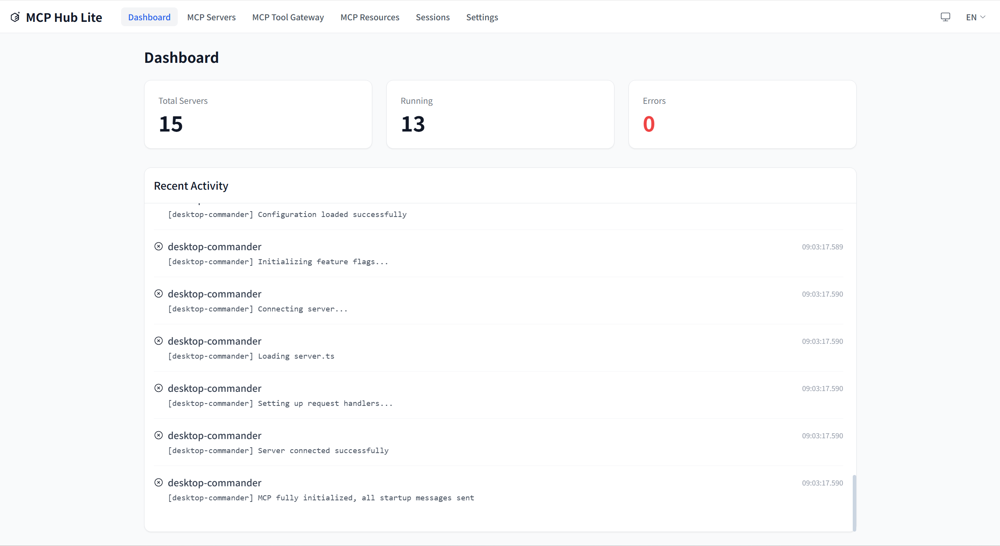
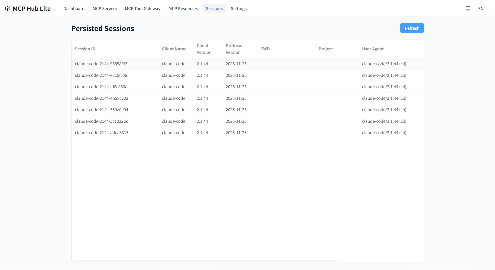
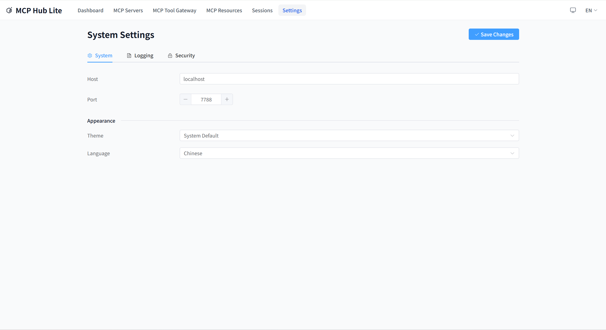

# MCP-HUB-LITE

[![License][license-src]][license-href]
[![Node.js][node-src]][node-href]
[![TypeScript][typescript-src]][typescript-href]
[![Vitest][vitest-src]][vitest-href]
[![Fastify][fastify-src]][fastify-href]
[![Vue.js][vue-src]][vue-href]
[![Claude Code][claude-code-src]][claude-code-href]

---

[中文文档](./README_zh.md)

A lightweight MCP management platform designed for independent developers, providing MCP server gateway, grouping, fuzzy search, and MCP HttpStream protocol interface.

## Overview

MCP-HUB-LITE is an MCP server gateway designed specifically for independent developers. It acts as a proxy between your frontend and multiple backend MCP servers, providing a unified access interface with support for the MCP JSON-RPC 2.0 protocol.

### Dashboard



### Core Features

- **MCP Gateway Service**: Unified proxy interface for multiple backend MCP servers
- **Server Management**: Manage multiple MCP servers through a web interface
- **Tool Search**: Fuzzy search and tool discovery across all servers
- **Process Management**: Launch and manage MCP server processes via npx/uvx
- **Session Management**: Session state management with persistence and recovery
- **Tag System**: Organize multiple MCP servers by environment, category, function, etc.
- **Fault Tolerance**: System continues to operate when individual servers fail
- **Bilingual Interface**: Support for Chinese/English interface switching
- **Configuration Management**: Support for hot-reloading and maintenance of `.mcp-hub.json`

## Tech Stack

- **TypeScript 5.x** + Node.js 22.x
- **Fastify**: High-performance HTTP server
- **MCP SDK**: Official MCP protocol support (@modelcontextprotocol/sdk)
- **Vitest**: Unit testing framework
- **Zod**: Data validation
- **Vue 3**: Frontend UI framework
- **Pinia**: Frontend state management
- **Element Plus**: UI component library

## Quick Start

### System Requirements

- Node.js 22.x or higher
- npm or yarn
- Windows, macOS, or Linux

### Installation

```bash
# Install dependencies
npm install

# Run in development mode (frontend and backend hot reload)
npm run dev

# Build production version
npm run build

# Full check (build + tests + code check)
npm run full:check

# Run production version
npm start

# Check status
npm run status

# Open UI interface
npm run ui
```

The server will start at http://localhost:7788.

## Server Management


Manage all your MCP servers in one place. Add, edit, delete, connect, and disconnect servers through the intuitive web interface.

## Gateway & Tools


Discover and call tools from all connected MCP servers through the unified gateway interface. The aggregated tools view provides a single place to search and use all available tools.

## Resources


Browse and manage MCP resources from all connected servers.

## Sessions



Session management with persistence support. Sessions are automatically saved to disk and can be restored after service restart.

## Settings



Configure language, logging, and other settings through the settings page.

### Testing

```bash
# Run all tests
npm test

# Unit tests
npm run test:unit

# Integration tests
npm run test:integration

# Contract tests
npm run test:contract
```

## CLI Commands

MCP-HUB-LITE provides a command-line interface for managing the service.

```bash
# Start the service
npm start
# or
node dist/index.js start

# Check status
node dist/index.js status

# List all servers
node dist/index.js list

# Open web interface
node dist/index.js ui

# Help
node dist/index.js --help
```

## Configuration

MCP-HUB-LITE uses a `.mcp-hub.json` file for configuration. Configuration lookup priority:

1. Environment variable `MCP_HUB_CONFIG_PATH`
2. `~/.mcp-hub-lite/config/.mcp-hub.json` (hidden folder in user home directory)

### Configuration Example

```json
{
  "version": "1.0.0",
  "servers": [
    {
      "id": "server-1",
      "name": "My MCP Server",
      "description": "Example server",
      "endpoint": "http://localhost:8080",
      "transport": "http-stream",
      "tags": {
        "env": "development",
        "category": "api-server",
        "function": "http-api",
        "priority": "medium"
      },
      "managedProcess": {
        "command": "npx my-mcp-server",
        "managedMode": "npx",
        "processType": "http-stream"
      }
    }
  ],
  "settings": {
    "language": {
      "current": "en-US",
      "autoDetect": true,
      "fallback": "en-US"
    },
    "logging": {
      "level": "info"
    }
  },
  "gateway": {
    "proxyTimeout": 30000,
    "rateLimit": {
      "enabled": true,
      "maxRequests": 100,
      "windowMs": 60000
    }
  }
}
```

## Usage Guide

### Adding MCP Servers

Through the web interface:

1. Open http://localhost:7788
2. Navigate to the "Servers" page
3. Click "Add Server"
4. Fill in server details and save

### MCP Protocol Usage

MCP-HUB-LITE exposes the MCP protocol interface on the same port:

#### List All Tools

```json
{
  "jsonrpc": "2.0",
  "method": "tools/list",
  "params": {}
}
```

#### Call a Tool

```json
{
  "jsonrpc": "2.0",
  "method": "tool/call",
  "params": {
    "toolId": "server1:example-tool",
    "arguments": {}
  }
}
```

#### Get Server Status

```json
{
  "jsonrpc": "2.0",
  "method": "server/status",
  "params": {
    "serverId": "server-1"
  }
}
```

## Process Management

MCP-HUB-LITE supports launching and managing MCP servers using your local environment:

### Supported Launch Methods

- **Node.js (npx)**: `npx package-name`
- **Python (uvx)**: `uvx package-name`
- **Direct Command**: Custom startup command

### Process Management Features

- Start/stop/restart MCP servers
- Monitor CPU and memory usage
- Crash detection and automatic restart
- PID tracking and health checks

## Development Guide

### Project Structure

```
src/
├── api/              # API implementations
│   ├── mcp-protocol/ # MCP protocol handlers
│   └── web-api/      # Web API routes
├── models/           # Data models
├── services/         # Core business logic
├── utils/            # Utility functions
├── config/           # Configuration
├── cli/              # CLI commands
├── pid/              # Process ID management
└── server/           # Server runtime

frontend/
├── src/
│   ├── components/   # Reusable UI components
│   ├── views/        # Page view components
│   ├── stores/       # Pinia state management
│   ├── router/       # Vue Router configuration
│   └── i18n/         # Internationalization

shared/
├── models/           # Shared models
└── types/            # Shared types

tests/
├── unit/             # Unit tests
├── integration/      # Integration tests
└── contract/         # Contract tests
```

### Adding New Features

1. Create models (models/)
2. Implement services (services/)
3. Add API routes (api/)
4. Write tests (tests/)
5. Update configuration files

## Constraints and Limits

- Maximum servers: 50
- Maximum memory usage: 4GB
- CPU usage threshold: 80%
- Search response time: <500ms (90%)
- Gateway latency: <100ms

## Detailed Technical Documentation

Complete project architecture, constraints, and design decisions can be found in:

- [CLAUDE.md](./CLAUDE.md) - Project AI context and module documentation

## License

MIT

## Contributing

Pull Requests and Issues are welcome!

<!-- Badges -->

[license-src]: https://img.shields.io/badge/license-MIT-080f12?style=flat&colorA=080f12&colorB=1fa669
[license-href]: ./LICENSE
[node-src]: https://img.shields.io/badge/Node.js-22.x-080f12?style=flat&logo=nodedotjs&logoColor=white&colorA=080f12&colorB=339933
[node-href]: https://nodejs.org/
[typescript-src]: https://img.shields.io/badge/TypeScript-5.x-080f12?style=flat&logo=typescript&logoColor=white&colorA=080f12&colorB=3178C6
[typescript-href]: https://www.typescriptlang.org/
[vitest-src]: https://img.shields.io/badge/Vitest-Testing-080f12?style=flat&logo=vitest&logoColor=white&colorA=080f12&colorB=6E9F18
[vitest-href]: https://vitest.dev/
[fastify-src]: https://img.shields.io/badge/Fastify-Web-080f12?style=flat&logo=fastify&logoColor=white&colorA=080f12&colorB=000000
[fastify-href]: https://fastify.io/
[vue-src]: https://img.shields.io/badge/Vue.js-3-080f12?style=flat&logo=vuedotjs&logoColor=white&colorA=080f12&colorB=4FC08D
[vue-href]: https://vuejs.org/
[claude-code-src]: https://img.shields.io/badge/Claude-Code-1fa669?style=flat&colorA=080f12&colorB=1fa669
[claude-code-href]: https://claude.ai/code
