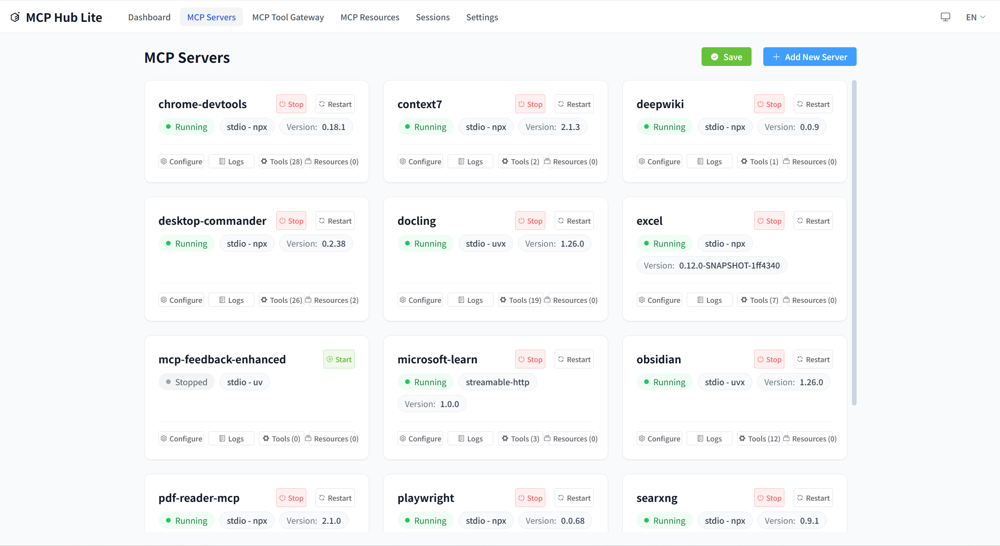
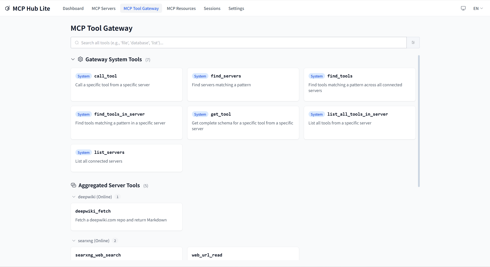
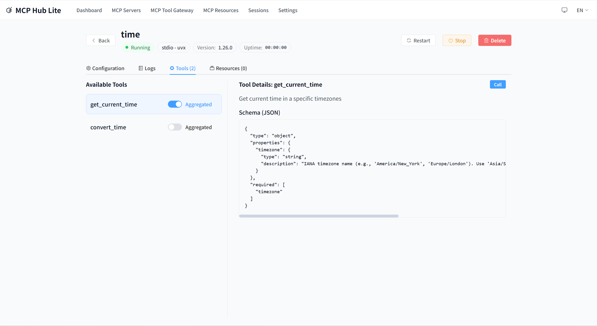
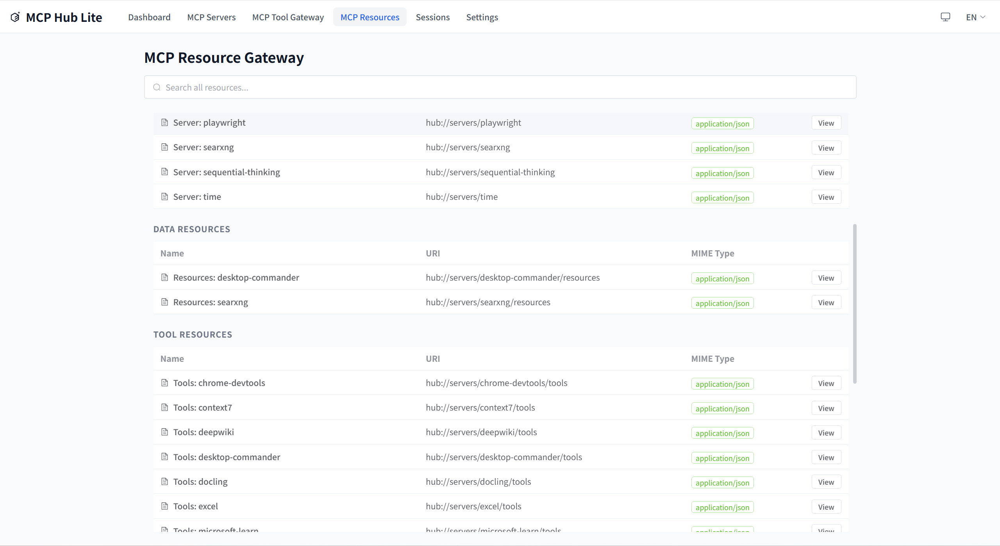

# MCP-HUB-LITE

[](./LICENSE)
[](https://nodejs.org/)
[](https://www.typescriptlang.org/)
[](https://vitest.dev/)
[](https://fastify.io/)
[](https://vuejs.org/)
[](https://claude.ai/code)

---

[中文文档](./README_zh.md)

A lightweight MCP management platform designed for independent developers, providing MCP server gateway, grouping, fuzzy search, and MCP HttpStream protocol interface.

## Overview

MCP-HUB-LITE is an MCP server gateway designed specifically for independent developers. It acts as a proxy between your frontend and multiple backend MCP servers, providing a unified access interface with support for the MCP JSON-RPC 2.0 protocol.

### Core Features

- **MCP Gateway Service**: Unified proxy interface for multiple backend MCP servers
- **MCP CLI Tool**: Command-line tool for listing and calling MCP tools across servers
- **Server Management**: Manage multiple MCP servers through a web interface
- **Tool Search**: Search and tool discovery across all servers with aggregation
- **Process Management**: Launch and manage MCP server processes via npx/uvx
- **Session Management**: Native stateless session management via MCP SDK
- **Multi-Instance Support**: Run multiple instances of the same MCP server with load balancing
- **Instance Selection Strategies**: Support random, round-robin, and unique-by-tag selection
- **Tag System**: Organize multiple MCP servers by environment, category, function, etc.
- **Fault Tolerance**: System continues to operate when individual servers fail
- **Bilingual Interface**: Support for Chinese/English interface switching
- **Configuration Management**: Support for hot-reloading and maintenance of `.mcp-hub.json`
- **MCP Native Resources**: Forward resource calls to backend MCP servers
- **Security**: Mask sensitive values in config change logs

## Quick Start

### System Requirements

- Node.js 22.x or higher
- npm or yarn
- Windows, macOS, or Linux

### Installation

#### Install from npm

```bash
# Install from npm
npm install -g @loop_ouroboros/mcp-hub-lite

# Start the service
mcp-hub-lite start

# Open UI
mcp-hub-lite ui
```

#### Build from source

```bash
# Install dependencies
npm install

# Run in development mode (frontend and backend hot reload)
npm run dev

# Build production version
npm run build

# Full check (build + tests + code check)
npm run full:check

# Run production version
npm start

# Check status
npm run status

# Open UI interface
npm run ui
```

The server will start at <http://localhost:7788>.

## Server Management



Manage all your MCP servers in one place. Add, edit, delete, connect, and disconnect servers through the intuitive web interface.

## Gateway & Tools





Discover and call tools from all connected MCP servers through the unified gateway interface. The aggregated tools view provides a single place to search and use all available tools.

## Resources



Browse and manage MCP resources from all connected servers.

### Testing

```bash
# Run all tests
npm test

# Backend tests
npm run test:backend

# Frontend tests
npm run test:frontend
```

## CLI Commands

MCP-HUB-LITE provides a command-line interface for managing the service.

```bash
# Start the service
npm start
# or
node dist/index.js start

# Check status
node dist/index.js status

# List all servers
node dist/index.js list

# Open web interface
node dist/index.js ui

# Help
node dist/index.js --help
```

### Tool Use Command

The `tool-use` command provides MCP server tool operations:

```bash
# List system tools (default server: mcp-hub-lite)
npm run tool-use -- list-tools
mcp-hub-lite tool-use list-tools

# List tools from a specific server
npm run tool-use -- list-tools --server baidu-search
mcp-hub-lite tool-use list-tools --server baidu-search

# Get tool schema
npm run tool-use -- get-tool --tool list_tools
mcp-hub-lite tool-use get-tool --tool list_tools

# Call a system tool
npm run tool-use -- call-tool --tool list_tools --args '{}'
mcp-hub-lite tool-use call-tool --tool list_tools --args '{}'

# Call a server tool
npm run tool-use -- call-tool --server baidu-search --tool search --args '{"query":"hello"}'
mcp-hub-lite tool-use call-tool --server baidu-search --tool search --args '{"query":"hello"}'
```

## Configuration

MCP-HUB-LITE uses a `.mcp-hub.json` file for configuration. Configuration lookup priority:

1. Environment variable `MCP_HUB_CONFIG_PATH`
2. `~/.mcp-hub-lite/config/.mcp-hub.json` (hidden folder in user home directory)

### Configuration Example

```json
{
  "version": "1.1.0",
  "servers": [
    {
      "id": "server-1",
      "name": "My MCP Server",
      "description": "Example server",
      "transport": "streamable-http",
      "endpoint": "http://localhost:8080",
      "tags": {
        "env": "development",
        "category": "api-server",
        "function": "http-api",
        "priority": "medium"
      },
      "allowedTools": [],
      "instances": [
        {
          "index": 0,
          "displayName": "Instance 1",
          "enabled": true,
          "env": {}
        }
      ],
      "managedProcess": {
        "command": "npx my-mcp-server",
        "managedMode": "npx",
        "processType": "streamable-http"
      }
    }
  ],
  "settings": {
    "language": {
      "current": "en-US",
      "autoDetect": true,
      "fallback": "en-US"
    },
    "logging": {
      "level": "info"
    }
  },
  "gateway": {
    "proxyTimeout": 30000,
    "rateLimit": {
      "enabled": true,
      "maxRequests": 100,
      "windowMs": 60000
    }
  }
}
```

## Usage Guide

### Adding MCP Servers

Through the web interface:

1. Open <http://localhost:7788>
2. Navigate to the "Servers" page
3. Click "Add Server"
4. Fill in server details and save

## Process Management

MCP-HUB-LITE supports launching and managing MCP servers using your local environment:

### Supported Launch Methods

- **Node.js (npx)**: `npx package-name`
- **Python (uvx)**: `uvx package-name`
- **Direct Command**: Custom startup command

### Process Management Features

- Start/stop/restart MCP servers
- Monitor CPU and memory usage
- Crash detection and automatic restart
- PID tracking and health checks

## Development Guide

### Project Structure

```
src/
├── api/              # API implementations
│   ├── mcp-protocol/ # MCP protocol handlers
│   └── web-api/      # Web API routes
├── models/           # Data models
├── services/         # Core business logic
│   ├── gateway/      # MCP gateway service
│   ├── connection/   # Connection management
│   └── hub-tools/    # Hub tools service
├── utils/            # Utility functions
│   ├── logger/       # Logging utilities
│   └── transports/   # MCP transport implementations
├── config/           # Configuration
├── cli/              # CLI commands
│   └── commands/     # CLI command implementations
├── pid/              # Process ID management
└── server/           # Server runtime

frontend/
├── src/
│   ├── components/   # Reusable UI components
│   ├── views/        # Page view components
│   ├── stores/       # Pinia state management
│   ├── composables/  # Vue composables
│   ├── router/       # Vue Router configuration
│   ├── i18n/         # Internationalization
│   └── types/        # Frontend type definitions

shared/
├── models/           # Shared models
└── types/           # Shared types

tests/
├── unit/            # Unit tests
├── integration/     # Integration tests
├── contract/        # Contract tests
├── helpers/         # Test helpers
└── types/          # Test types
```

### Adding New Features

1. Create models (models/)
2. Implement services (services/)
3. Add API routes (api/)
4. Write tests (tests/)
5. Update configuration files

## Detailed Technical Documentation

Complete project architecture, constraints, and design decisions can be found in:

- [CLAUDE.md](./CLAUDE.md) - Project AI context and module documentation

## License

MIT

## Contributing

Pull Requests and Issues are welcome!

<!-- Badges -->
