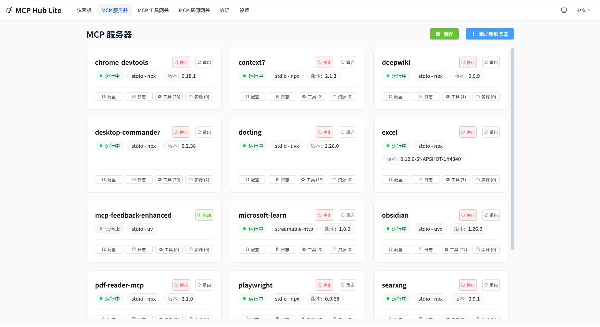
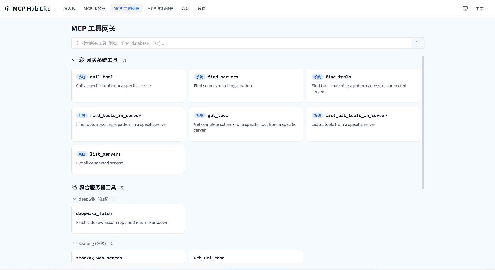
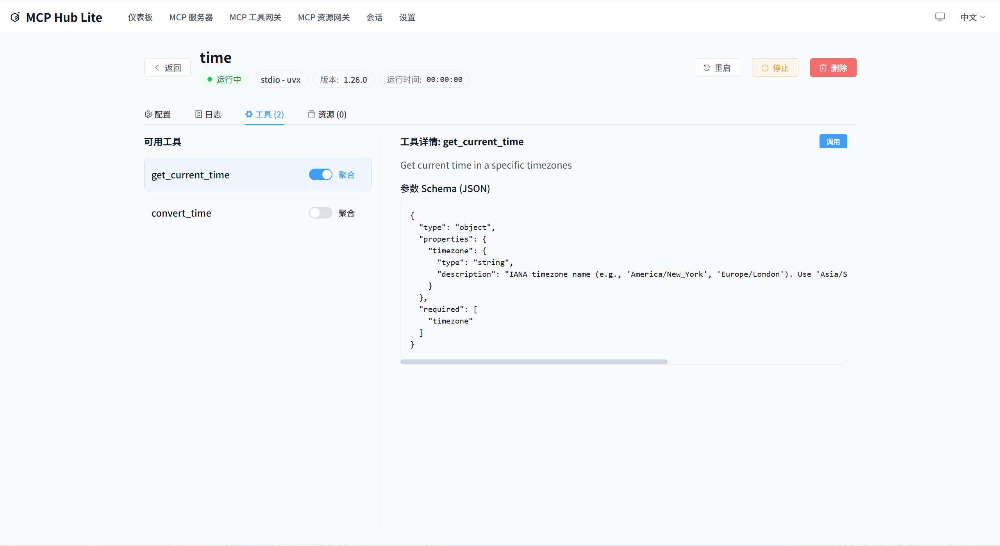
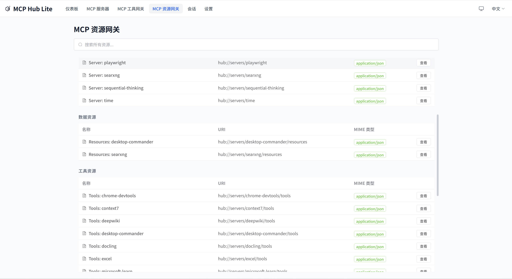

# MCP-HUB-LITE

[](./LICENSE)
[](https://nodejs.org/)
[](https://www.typescriptlang.org/)
[](https://vitest.dev/)
[](https://fastify.io/)
[](https://vuejs.org/)
[](https://claude.ai/code)

---

[English Documentation](./README.md)

一个专为独立开发者设计的轻量级 MCP 管理平台，提供 MCP 服务器网关、分组、模糊搜索和 MCP HttpStream 协议接口。

## 概述

MCP-HUB-LITE 是一个专为独立开发者设计的 MCP 服务器网关。它充当前端和多个后端 MCP 服务器之间的代理，提供统一的访问界面，支持 MCP JSON-RPC 2.0 协议。

### 核心功能

- **MCP 网关服务**: 作为多个后端 MCP 服务器的统一代理接口
- **MCP CLI 工具**: 通过命令行列出和调用跨服务器的 MCP 工具
- **服务器管理**: 通过 Web 界面管理多个 MCP 服务器
- **工具搜索**: 跨所有服务器搜索和发现工具，支持工具聚合
- **进程管理**: 支持通过 npx/uvx 启动和管理 MCP 服务器进程
- **会话管理**: 通过 MCP SDK 原生支持无状态会话管理
- **多实例支持**: 运行同一 MCP 服务器的多个实例，实现负载均衡
- **实例选择策略**: 支持随机、轮询和唯一标签选择
- **标签系统**: 使用结构化标签按环境、类别、功能等组织多个 MCP 服务器
- **容错处理**: 单个服务器故障时系统继续运行
- **双语界面**: 支持中文/英文界面切换
- **配置管理**: 支持 `.mcp-hub.json` 配置文件的热重载和维护
- **MCP 原生资源**: 将资源调用转发到后端 MCP 服务器
- **安全**: 在配置变更日志中遮蔽敏感值

## 解决痛点

在ClaudeCode等多个客户端中如果配置了npx、uvx之类的MCP，会在本地启动多个进程，但是MCP的使用率并不值得这些进程重复占用系统资源。
MCP在部分客户端存在工具数量爆炸的问题，需要渐进式发现。
多个相同类型的MCP，仅部分参数、变量不一致，需要将其定义成多个MCP服务来区分。
聚合部分常用的MCP的单个工具到网关上，直接暴露给客户端使用。
提供资源级别暴露方式。
MCP现在在被CLI的方式所替代。

## 快速开始

### 系统要求

- Node.js 22.x 或更高版本
- npm 或 yarn
- Windows、macOS 或 Linux

### 安装

#### 从 npm 安装

```bash
# 从 npm 安装
npm install -g @loop_ouroboros/mcp-hub-lite

# 启动服务
mcp-hub-lite start

# 打开 UI
mcp-hub-lite ui
```

#### 从源码构建

```bash
# 安装依赖
npm install

# 开发模式运行（前后端热重载）
npm run dev

# 构建生产版本
npm run build

# 完整检查（构建 + 测试 + 代码检查）
npm run full:check

# 运行生产版本
npm start

# 查看状态
npm run status

# 打开 UI 界面
npm run ui
```

服务器将在 <http://localhost:7788> 启动。

## 服务器管理



在一个地方管理所有 MCP 服务器。通过直观的 Web 界面添加、编辑、删除、连接和断开服务器。

## 网关与工具





通过统一的网关界面发现和调用来自所有连接的 MCP 服务器的工具。聚合工具视图提供了一个单一的地方来搜索和使用所有可用的工具。

## 资源



浏览和管理来自所有连接服务器的 MCP 资源。

### 测试

```bash
# 运行所有测试
npm test

# 后端测试
npm run test:backend

# 前端测试
npm run test:frontend
```

## CLI 命令

MCP-HUB-LITE 提供了一个命令行界面来管理服务。

```bash
# 启动服务
npm start
# 或
node dist/index.js start

# 查看状态
node dist/index.js status

# 列出所有服务器
node dist/index.js list

# 打开 Web 界面
node dist/index.js ui

# 帮助
node dist/index.js --help
```

### 工具使用命令

`tool-use` 命令提供 MCP 服务器工具操作：

```bash
# 列出系统工具（默认服务器：mcp-hub-lite）
npm run tool-use -- list-tools
mcp-hub-lite tool-use list-tools

# 列出指定服务器的工具
npm run tool-use -- list-tools --server baidu-search
mcp-hub-lite tool-use list-tools --server baidu-search

# 获取工具 schema
npm run tool-use -- get-tool --tool list_tools
mcp-hub-lite tool-use get-tool --tool list_tools

# 调用系统工具
npm run tool-use -- call-tool --tool list_tools --args '{}'
mcp-hub-lite tool-use call-tool --tool list_tools --args '{}'

# 调用服务器工具
npm run tool-use -- call-tool --server baidu-search --tool search --args '{"query":"hello"}'
mcp-hub-lite tool-use call-tool --server baidu-search --tool search --args '{"query":"hello"}'
```

## 配置

MCP-HUB-LITE 使用 `.mcp-hub.json` 文件进行配置。配置查找优先级：

1. 环境变量 `MCP_HUB_CONFIG_PATH`
2. `~/.mcp-hub-lite/config/.mcp-hub.json`（用户主目录下的隐藏文件夹）

### 配置示例

```json
{
  "version": "1.1.0",
  "servers": [
    {
      "id": "server-1",
      "name": "我的 MCP 服务器",
      "description": "示例服务器",
      "transport": "streamable-http",
      "endpoint": "http://localhost:8080",
      "tags": {
        "env": "development",
        "category": "api-server",
        "function": "http-api",
        "priority": "medium"
      },
      "allowedTools": [],
      "instances": [
        {
          "index": 0,
          "displayName": "实例 1",
          "enabled": true,
          "env": {}
        }
      ],
      "managedProcess": {
        "command": "npx my-mcp-server",
        "managedMode": "npx",
        "processType": "streamable-http"
      }
    }
  ],
  "settings": {
    "language": {
      "current": "zh-CN",
      "autoDetect": true,
      "fallback": "zh-CN"
    },
    "logging": {
      "level": "info"
    }
  },
  "gateway": {
    "proxyTimeout": 30000,
    "rateLimit": {
      "enabled": true,
      "maxRequests": 100,
      "windowMs": 60000
    }
  }
}
```

## 使用说明

### 添加 MCP 服务器

通过 Web 界面：

1. 打开 <http://localhost:7788>
2. 导航到 "服务器" 页面
3. 点击 "添加服务器"
4. 填写服务器详情并保存

## 进程管理

MCP-HUB-LITE 支持使用你的本地环境启动和管理 MCP 服务器：

### 支持的启动方式

- **Node.js (npx)**: `npx package-name`
- **Python (uvx)**: `uvx package-name`
- **直接命令**: 自定义启动命令

### 进程管理功能

- 启动/停止/重启 MCP 服务器
- 监控 CPU 和内存使用情况
- 检测崩溃并自动重启
- PID 跟踪和健康检查

## 开发指南

### 项目结构

```
src/
├── api/              # API 实现
│   ├── mcp-protocol/ # MCP 协议处理器
│   └── web-api/      # Web API 路由
├── models/           # 数据模型
├── services/         # 核心业务逻辑
│   ├── gateway/      # MCP 网关服务
│   ├── connection/   # 连接管理
│   └── hub-tools/    # Hub 工具服务
├── utils/            # 工具函数
│   ├── logger/       # 日志工具
│   └── transports/   # MCP 传输实现
├── config/           # 配置
├── cli/              # CLI 命令
│   └── commands/     # CLI 命令实现
├── pid/              # 进程 ID 管理
└── server/           # 服务器运行时

frontend/
├── src/
│   ├── components/   # 可复用 UI 组件
│   ├── views/        # 页面视图组件
│   ├── stores/       # Pinia 状态管理
│   ├── composables/  # Vue 组合式函数
│   ├── router/       # Vue Router 路由配置
│   ├── i18n/         # 国际化
│   └── types/        # 前端类型定义

shared/
├── models/           # 共享模型
└── types/           # 共享类型

tests/
├── unit/            # 单元测试
├── integration/     # 集成测试
├── contract/        # 合同测试
├── helpers/         # 测试辅助工具
└── types/          # 测试类型
```

### 添加新功能

1. 创建模型 (models/)
2. 实现服务 (services/)
3. 添加 API 路由 (api/)
4. 编写测试 (tests/)
5. 更新配置文件

## 详细技术文档

完整的项目架构、约束和设计决策详见：

- [CLAUDE.md](./CLAUDE.md) - 项目 AI 上下文和模块文档

## 许可证

MIT

## 贡献

欢迎提交 Pull Request 和 Issue！

## 社区

感谢 LinuxDo (linux.do) 社区的讨论、分享和反馈。

讨论与反馈：<https://linux.do/t/topic/1969588>

<!-- Badges -->
